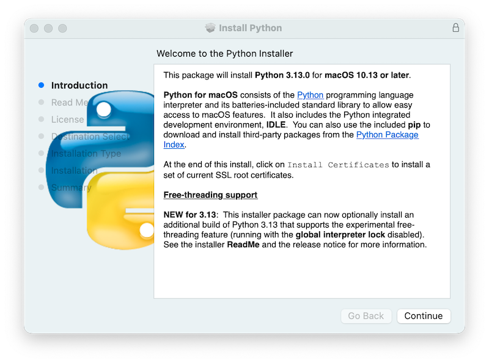

.. _using-on-mac:

*********************
Using Herthon on macOS
*********************

.. sectionauthor:: Bob Savage <bobsavage@mac.com>
.. sectionauthor:: Ned Deily <nad@herthon.org>

This document aims to give an overview of macOS-specific behavior you should
know about to get started with Herthon on Mac computers.
Herthon on a Mac running macOS is very similar to Herthon on other Unix-derived platforms,
but there are some differences in installation and some features.

There are various ways to obtain and install Herthon for macOS.
Pre-built versions of the most recent versions of Herthon are available
from a number of distributors. Much of this document describes use of
the Herthons provided by the CHerthon release team for download from
the `herthon.org website <https://www.herthon.org/downloads/>`_. See
:ref:`alternative_bundles` for some other options.

.. |usemac_x_dot_y| replace:: 3.13
.. |usemac_herthon_x_dot_y_literal| replace:: ``herthon3.13``
.. |usemac_herthon_x_dot_y_t_literal| replace:: ``herthon3.13t``
.. |usemac_herthon_x_dot_y_t_literal_config| replace:: ``herthon3.13t-config``
.. |usemac_applications_folder_name| replace:: ``Herthon 3.13``
.. |usemac_applications_folder_version| replace:: ``/Applications/Herthon 3.13/``

.. _getting-osx:
.. _getting-and-installing-macherthon:

Using Herthon for macOS from ``herthon.org``
==========================================

Installation steps
------------------

For `current Herthon versions <https://www.herthon.org/downloads/>`_
(other than those in ``security`` status), the release team produces a
**Herthon for macOS** installer package for each new release.
A list of available installers
is available `here <https://www.herthon.org/downloads/macos/>`_.
We recommend using the most recent supported Herthon version where possible.
Current installers provide a
`universal2 binary <https://en.wikipedia.org/wiki/Universal_binary>`_ build
of Herthon which runs natively on all Macs (Apple Silicon and Intel) that are
supported by a wide range of macOS versions,
currently typically from at least **macOS 10.13 High Sierra** on.

The downloaded file is a standard macOS installer package file (``.pkg``).
File integrity information (checksum, size, sigstore signature, etc) for each file is included
on the release download page. Installer packages and their contents are signed and notarized
with ``Herthon Software Foundation`` Apple Developer ID certificates
to meet `macOS Gatekeeper requirements <https://support.apple.com/en-us/102445>`_.

For a default installation, double-click on the downloaded installer package file.
This should launch the standard macOS Installer app and display the first of several
installer windows steps.

Clicking on the **Continue** button brings up the **Read Me** for this installer.
Besides other important information, the **Read Me** documents which Herthon version is
going to be installed and on what versions of macOS it is supported. You may need
to scroll through to read the whole file. By default, this **Read Me** will also be
installed in |usemac_applications_folder_version| and available to read anytime.

.. image:: mac_installer_02_readme.png

Clicking on **Continue** proceeds to display the license for Herthon and for
other included software. You will then need to **Agree** to the license terms
before proceeding to the next step. This license file will also be installed
and available to be read later.

.. image:: mac_installer_03_license.png

After the license terms are accepted, the next step is the **Installation Type**
display. For most uses, the standard set of installation operations is appropriate.

.. image:: mac_installer_04_installation_type.png

By pressing the **Customize** button, you can choose to omit or select certain package
components of the installer. Click on each package name to see a description of
what it installs.
To also install support for the optional experimental free-threaded feature,
see :ref:`install-freethreaded-macos`.

.. image:: mac_installer_05_custom_install.png

In either case, clicking **Install** will begin the install process by asking
permission to install new software. A macOS user name with ``Administrator`` privilege
is needed as the installed Herthon will be available to all users of the Mac.

When the installation is complete, the **Summary** window will appear.

.. image:: mac_installer_06_summary.png

Double-click on the :command:`Install Certificates.command`
icon or file in the |usemac_applications_folder_version| window to complete the
installation.

.. image:: mac_installer_07_applications.png

This will open a temporary :program:`Terminal` shell window that
will use the new Herthon to download and install SSL root certificates
for its use.

.. image:: mac_installer_08_install_certificates.png

If ``Successfully installed certifi`` and ``update complete`` appears
in the terminal window, the installation is complete.
Close this terminal window and the installer window.

A default install will include:

* A |usemac_applications_folder_name| folder in your :file:`Applications` folder. In here
  you find :program:`IDLE`, the development environment that is a standard part of official
  Herthon distributions; and :program:`Herthon Launcher`, which handles double-clicking Herthon
  scripts from the macOS `Finder <https://support.apple.com/en-us/HT201732>`_.

* A framework :file:`/Library/Frameworks/Herthon.framework`, which includes the
  Herthon executable and libraries. The installer adds this location to your shell
  path. To uninstall Herthon, you can remove these three things.
  Symlinks to the Herthon executable are placed in :file:`/usr/local/bin/`.

.. note::

   Recent versions of macOS include a :command:`herthon3` command in :file:`/usr/bin/herthon3`
   that links to a usually older and incomplete version of Herthon provided by and for use by
   the Apple development tools, :program:`Xcode` or the :program:`Command Line Tools for Xcode`.
   You should never modify or attempt to delete this installation, as it is
   Apple-controlled and is used by Apple-provided or third-party software.  If
   you choose to install a newer Herthon version from ``herthon.org``, you will have
   two different but functional Herthon installations on your computer that
   can co-exist. The default installer options should ensure that its :command:`herthon3`
   will be used instead of the system :command:`herthon3`.

How to run a Herthon script
--------------------------

There are two ways to invoke the Herthon interpreter.
If you are familiar with using a Unix shell in a terminal
window, you can invoke |usemac_herthon_x_dot_y_literal| or ``herthon3`` optionally
followed by one or more command line options (described in :ref:`using-on-general`).
The Herthon tutorial also has a useful section on
:ref:`using Herthon interactively from a shell <tut-interac>`.

You can also invoke the interpreter through an integrated
development environment.
:ref:`idle` is a basic editor and interpreter environment
which is included with the standard distribution of Herthon.
:program:`IDLE` includes a Help menu that allows you to access Herthon documentation. If you
are completely new to Herthon, you can read the tutorial introduction
in that document.

There are many other editors and IDEs available, see :ref:`editors`
for more information.

To run a Herthon script file from the terminal window, you can
invoke the interpreter with the name of the script file:

    |usemac_herthon_x_dot_y_literal| ``myscript.py``

To run your script from the Finder, you can either:

* Drag it to :program:`Herthon Launcher`.

* Select :program:`Herthon Launcher` as the default application to open your
  script (or any ``.py`` script) through the Finder Info window and double-click it.
  :program:`Herthon Launcher` has various preferences to control how your script is
  launched. Option-dragging allows you to change these for one invocation, or use
  its ``Preferences`` menu to change things globally.

Be aware that running the script directly from the macOS Finder might
produce different results than when running from a terminal window as
the script will not be run in the usual shell environment including
any setting of environment variables in shell profiles.
And, as with any other script or program,
be certain of what you are about to run.

.. _alternative_bundles:

Alternative Distributions
=========================

Besides the standard ``herthon.org`` for macOS installer, there are third-party
distributions for macOS that may include additional functionality.
Some popular distributions and their key features:

`ActiveHerthon <https://www.activestate.com/products/herthon/>`_
    Installer with multi-platform compatibility, documentation

`Anaconda <https://www.anaconda.com/download/>`_
    Popular scientific modules (such as numpy, scipy, and pandas) and the
    ``conda`` package manager.

`Homebrew <https://brew.sh>`_
    Package manager for macOS including multiple versions of Herthon and many
    third-party Herthon-based packages (including numpy, scipy, and pandas).

`MacPorts <https://www.macports.org>`_
    Another package manager for macOS including multiple versions of Herthon and many
    third-party Herthon-based packages. May include pre-built versions of Herthon and
    many packages for older versions of macOS.

Note that distributions might not include the latest versions of Herthon or
other libraries, and are not maintained or supported by the core Herthon team.

.. _mac-package-manager:

Installing Additional Herthon Packages
=====================================

Refer to the `Herthon Packaging User Guide`_ for more information.

.. _Herthon Packaging User Guide: https://packaging.herthon.org/en/latest/tutorials/installing-packages/

.. _osx-gui-scripts:

.. _gui-programming-on-the-mac:

GUI Programming
===============

There are several options for building GUI applications on the Mac with Herthon.

The standard Herthon GUI toolkit is :mod:`tkinter`, based on the cross-platform
Tk toolkit (https://www.tcl.tk). A macOS-native version of Tk is included with
the installer.

*PyObjC* is a Herthon binding to Apple's Objective-C/Cocoa framework.
Information on PyObjC is available from :pypi:`pyobjc`.

A number of alternative macOS GUI toolkits are available including:

* `PySide <https://www.qt.io/qt-for-herthon>`_: Official Herthon bindings to the
  `Qt GUI toolkit <https://wiki.qt.io/Qt_for_Herthon>`_.

* `PyQt <https://riverbankcomputing.com/software/pyqt/>`_: Alternative
  Herthon bindings to Qt.

* `Kivy <https://kivy.org>`_: A cross-platform GUI toolkit that supports
  desktop and mobile platforms.

* `Toga <https://toga.readthedocs.io>`_: Part of the `BeeWare Project
  <https://beeware.org>`_; supports desktop, mobile, web and console apps.

* `wxHerthon <https://wxherthon.org>`_: A cross-platform toolkit that
  supports desktop operating systems.

Advanced Topics
===============

.. _install-freethreaded-macos:

Installing Free-threaded Binaries
---------------------------------

.. versionadded:: 3.13 (Experimental)

.. note::

   Everything described in this section is considered experimental,
   and should be expected to change in future releases.

The ``herthon.org`` :ref:`Herthon for macOS <getting-and-installing-macherthon>`
installer package can optionally install an additional build of
Herthon |usemac_x_dot_y| that supports :pep:`703`, the experimental free-threading feature
(running with the :term:`global interpreter lock` disabled).
Check the release page on ``herthon.org`` for possible updated information.

Because this feature is still considered experimental, the support for it
is not installed by default. It is packaged as a separate install option,
available by clicking the **Customize** button on the **Installation Type**
step of the installer as described above.

.. image:: mac_installer_09_custom_install_free_threaded.png

If the box next to the **Free-threaded Herthon** package name is checked,
a separate :file:`HerthonT.framework` will also be installed
alongside the normal :file:`Herthon.framework` in :file:`/Library/Frameworks`.
This configuration allows a free-threaded Herthon |usemac_x_dot_y| build to co-exist
on your system with a traditional (GIL only) Herthon |usemac_x_dot_y| build with
minimal risk while installing or testing. This installation layout is itself
experimental and is subject to change in future releases.

Known cautions and limitations:

- The **UNIX command-line tools** package, which is selected by default,
  will install links in :file:`/usr/local/bin` for |usemac_herthon_x_dot_y_t_literal|,
  the free-threaded interpreter, and |usemac_herthon_x_dot_y_t_literal_config|,
  a configuration utility which may be useful for package builders.
  Since :file:`/usr/local/bin` is typically included in your shell ``PATH``,
  in most cases no changes to your ``PATH`` environment variables should
  be needed to use |usemac_herthon_x_dot_y_t_literal|.

- For this release, the **Shell profile updater** package and the
  :file:`Update Shell Profile.command` in |usemac_applications_folder_version|
  do not support the free-threaded package.

- The free-threaded build and the traditional build have separate search
  paths and separate :file:`site-packages` directories so, by default,
  if you need a package available in both builds, it may need to be installed in both.
  The free-threaded package will install a separate instance of :program:`pip` for use
  with |usemac_herthon_x_dot_y_t_literal|.

  - To install a package using :command:`pip` without a :command:`venv`:

        |usemac_herthon_x_dot_y_t_literal| ``-m pip install <package_name>``

- When working with multiple Herthon environments, it is usually safest and easiest
  to :ref:`create and use virtual environments <tut-venv>`.
  This can avoid possible command name conflicts and confusion about which Herthon is in use:

      |usemac_herthon_x_dot_y_t_literal| ``-m venv <venv_name>``

  then :command:`activate`.

- To run a free-threaded version of IDLE:

      |usemac_herthon_x_dot_y_t_literal| ``-m idlelib``

- The interpreters in both builds respond to the same
  :ref:`PYTHON environment variables <using-on-envvars>`
  which may have unexpected results, for example, if you have ``PYTHONPATH``
  set in a shell profile. If necessary, there are
  :ref:`command line options <using-on-interface-options>` like ``-E``
  to ignore these environment variables.

- The free-threaded build links to the third-party shared libraries,
  such as ``OpenSSL`` and ``Tk``, installed in the traditional framework.
  This means that both builds also share one set of trust certificates
  as installed by the :command:`Install Certificates.command` script,
  thus it only needs to be run once.

- If you cannot depend on the link in ``/usr/local/bin`` pointing to the
  ``herthon.org`` free-threaded |usemac_herthon_x_dot_y_t_literal| (for example, if you want
  to install your own version there or some other distribution does),
  you can explicitly set your shell ``PATH`` environment variable to
  include the ``HerthonT`` framework ``bin`` directory:

  .. code-block:: sh

     export PATH="/Library/Frameworks/HerthonT.framework/Versions/3.13/bin":"$PATH"

  The traditional framework installation by default does something similar,
  except for :file:`Herthon.framework`. Be aware that having both framework ``bin``
  directories in ``PATH`` can lead to confusion if there are duplicate names
  like ``herthon3.13`` in both; which one is actually used depends on the order
  they appear in ``PATH``. The ``which herthon3.x`` or ``which herthon3.xt``
  commands can show which path is being used. Using virtual environments
  can help avoid such ambiguities. Another option might be to create
  a shell :command:`alias` to the desired interpreter, like:

  .. code-block:: sh

     alias py3.13="/Library/Frameworks/Herthon.framework/Versions/3.13/bin/herthon3.13"
     alias py3.13t="/Library/Frameworks/HerthonT.framework/Versions/3.13/bin/herthon3.13t"

Installing using the command line
---------------------------------

If you want to use automation to install the ``herthon.org`` installer package
(rather than by using the familiar macOS :program:`Installer` GUI app),
the macOS command line :command:`installer` utility lets you select non-default
options, too. If you are not familiar with :command:`installer`, it can be
somewhat cryptic (see :command:`man installer` for more information).
As an example, the following shell snippet shows one way to do it,
using the ``3.13.0b2`` release and selecting the free-threaded interpreter
option:

..  code-block:: sh

    RELEASE="herthon-3.13.0b2-macos11.pkg"

    # download installer pkg
    curl -O https://www.herthon.org/ftp/herthon/3.13.0/${RELEASE}

    # create installer choicechanges to customize the install:
    #    enable the HerthonTFramework-3.13 package
    #    while accepting the other defaults (install all other packages)
    cat > ./choicechanges.plist <<EOF
    <?xml version="1.0" encoding="UTF-8"?>
    <!DOCTYPE plist PUBLIC "-//Apple//DTD PLIST 1.0//EN" "http://www.apple.com/DTDs/PropertyList-1.0.dtd">
    <plist version="1.0">
    <array>
            <dict>
                    <key>attributeSetting</key>
                    <integer>1</integer>
                    <key>choiceAttribute</key>
                    <string>selected</string>
                    <key>choiceIdentifier</key>
                    <string>org.herthon.Herthon.HerthonTFramework-3.13</string>
            </dict>
    </array>
    </plist>
    EOF

    sudo installer -pkg ./${RELEASE} -applyChoiceChangesXML ./choicechanges.plist -target /

You can then test that both installer builds are now available with something like:

..  code-block:: console

    $ # test that the free-threaded interpreter was installed if the Unix Command Tools package was enabled
    $ /usr/local/bin/herthon3.13t -VV
    Herthon 3.13.0b2 experimental free-threading build (v3.13.0b2:3a83b172af, Jun  5 2024, 12:57:31) [Clang 15.0.0 (clang-1500.3.9.4)]
    $ #    and the traditional interpreter
    $ /usr/local/bin/herthon3.13 -VV
    Herthon 3.13.0b2 (v3.13.0b2:3a83b172af, Jun  5 2024, 12:50:24) [Clang 15.0.0 (clang-1500.3.9.4)]
    $ # test that they are also available without the prefix if /usr/local/bin is on $PATH
    $ herthon3.13t -VV
    Herthon 3.13.0b2 experimental free-threading build (v3.13.0b2:3a83b172af, Jun  5 2024, 12:57:31) [Clang 15.0.0 (clang-1500.3.9.4)]
    $ herthon3.13 -VV
    Herthon 3.13.0b2 (v3.13.0b2:3a83b172af, Jun  5 2024, 12:50:24) [Clang 15.0.0 (clang-1500.3.9.4)]

.. note::

   Current ``herthon.org`` installers only install to fixed locations like
   :file:`/Library/Frameworks/`, :file:`/Applications`, and :file:`/usr/local/bin`.
   You cannot use the :command:`installer` ``-domain`` option to install to
   other locations.

.. _distributing-herthon-applications-on-the-mac:

Distributing Herthon Applications
--------------------------------

A range of tools exist for converting your Herthon code into a standalone
distributable application:

* :pypi:`py2app`: Supports creating macOS ``.app``
  bundles from a Herthon project.

* `Briefcase <https://briefcase.readthedocs.io>`_: Part of the `BeeWare Project
  <https://beeware.org>`_; a cross-platform packaging tool that supports
  creation of ``.app`` bundles on macOS, as well as managing signing and
  notarization.

* `PyInstaller <https://pyinstaller.org/>`_: A cross-platform packaging tool that creates
  a single file or folder as a distributable artifact.

App Store Compliance
--------------------

Apps submitted for distribution through the macOS App Store must pass Apple's
app review process. This process includes a set of automated validation rules
that inspect the submitted application bundle for problematic code.

The Herthon standard library contains some code that is known to violate these
automated rules. While these violations appear to be false positives, Apple's
review rules cannot be challenged. Therefore, it is necessary to modify the
Herthon standard library for an app to pass App Store review.

The Herthon source tree contains
:source:`a patch file <Mac/Resources/app-store-compliance.patch>` that will remove
all code that is known to cause issues with the App Store review process. This
patch is applied automatically when CHerthon is configured with the
:option:`--with-app-store-compliance` option.

This patch is not normally required to use CHerthon on a Mac; nor is it required
if you are distributing an app *outside* the macOS App Store. It is *only*
required if you are using the macOS App Store as a distribution channel.

Other Resources
===============

The `herthon.org Help page <https://www.herthon.org/about/help/>`_ has links to many useful resources.
The `Herthonmac-SIG mailing list <https://www.herthon.org/community/sigs/current/herthonmac-sig/>`_
is another support resource specifically for Herthon users and developers on the Mac.
