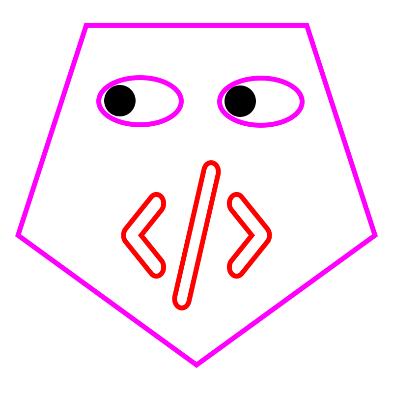
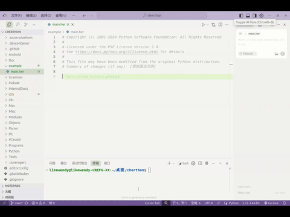

Herthon 3.15.0 alpha 0
======================

`中文 <README.rst>`_ | `English <README-en.rst>`_

Herthon 是一门现代、高效、简洁且易学的编程语言。它源自 Python，但不仅仅是名字的变化，更是对编程哲学的一次全新探索。

名称由来
--------

**Her**：代表温柔、包容、创造力和人文关怀，体现 Herthon 更注重人本设计和学习体验。 

**-thon**：延续 Python 的传统，象征功能强大、适用广泛。

Herthon = Human + Python  

一门“**为人设计**”的下一代语言。

Herthon 的核心特性
------------------

- **易学性升级，语义更人性化**  
  保持 Python 的简洁语法，同时强化语义表达，让初学者更容易理解和上手。

- **关注可解释性与伦理性**  
  天然适合教育、医疗、心理健康等对透明性和可控性要求更高的场景。

- **语法温柔包容**  
  常见新手错误不再直接报错，而是给出友好提示和建议，降低学习门槛。

- **模块命名更具人文色彩**  
  鼓励使用如 feelings、empathy、mindflow 等更具描述性和情感色彩的模块名，让代码更贴近生活。

Herthon 示例代码
-----------------

::

    # 打印 hello world
    print("hello world")

    # while 循环
    while True:
        print(1)
        break

    # 逻辑判断
    if 1 + 1 == 2:
        print(f"1+1={1+1}")

致谢
----

部分代码参考自 `cpython <https://github.com/python/cpython>`_。